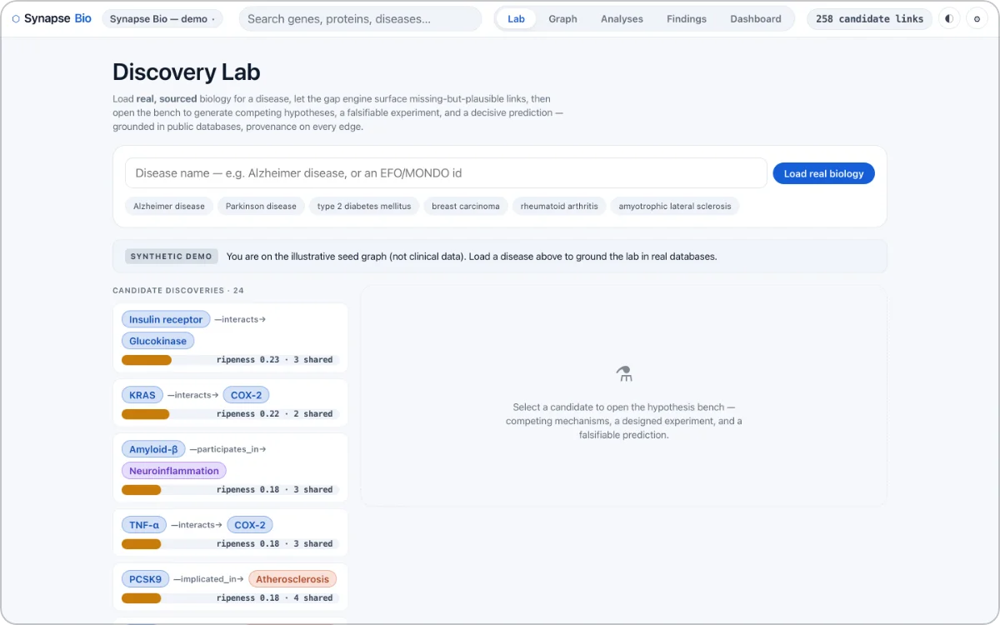

# SYNAPSE BIO

> **A biological discovery-graph lab for in-silico hypothesis generation: it computes not what is known but what is missing and plausible, ranking those gaps as candidate discoveries.**

**Live:** [synapse-bio-smoky.vercel.app](https://synapse-bio-smoky.vercel.app)

  

Five surfaces — Lab, Graph, Analyses, Findings, Dashboard — over a graph of genes, proteins, pathways, diseases and drugs. Vanilla no-build: `index.html` loads global/IIFE scripts and a vendored `force-graph` + GSAP. Static on Vercel behind a response-header CSP narrowing `connect-src` to `'self'` and one Worker origin, holding D1 and KV. The 109-node, 180-link seed graph is **synthetic and illustrative**, not a curated clinical source; the Lab surface states that predicted links are hypotheses to investigate — not clinical facts or medical advice.

## Ranking a missing edge by how under-studied it is

`js/gap-engine.js` is pure and deterministic: for type-compatible pairs with no direct edge it generates candidates by Swanson ABC open discovery plus **Adamic–Adar**, rewarding rare, specific intermediates, then scores `ripeness = plausibility × (1 − localCoverage)` — high plausibility on thin local evidence is a ripe lead. The nine presets also use Tarjan bridges, Brandes betweenness, PageRank, label-propagation communities, hypergeometric enrichment and random-walk-with-restart propagation.

## Assembling a provenance-stamped subgraph from four public databases

`/api/kg/build?disease=` composes a real subgraph in the app's `{nodes, links}` shape from **Open Targets** (GraphQL association scores, `drugAndClinicalCandidates`), **Reactome** via `target.pathways`, **STRING** PPIs and **ChEMBL** drugs (also via Open Targets). Two judgement calls carry the honesty: a pathway is kept only when **shared by ≥2 targets**, making it a genuine ABC intermediate; and `maxClinicalStage` is trial progression, not efficacy, so a drug–disease edge is `treats` only at approved phase, `in_trials_for` otherwise. Every node carries `prov{source, id, endpoint, retrievedAt}`, every edge a `prov` stamp naming its source and record id; `/api/lit` returns Europe PMC co-occurrence counts so the Swanson numbers are measured, not assumed.

## Forcing competing hypotheses, one of them always the null

`js/hypothesis.js` (pure, 11 tests) refuses a single story. It emits competing hypotheses **always including the honest null** — the co-study confound — scored on five criteria (testability, falsifiability, parsimony, explanatory power, novelty) as labelled priors, not probabilities. The null is built to win on promiscuous-hub mediators; on a live Alzheimer's graph, calibration ran 25 mechanism to 15 null across 40 candidates. Each dossier carries a designed experiment — controls, mediator arm, named statistical test, reproducibility pitfall — and a falsifiable prediction agreeing with the winner.

## Failing closed on every metered and writing endpoint

The per-IP limiter refuses requests when its KV binding is missing. `/api/findings` demands an `x-sync-token` compared in constant time: unset secret 503, wrong token 401. Anthropic calls sit behind a **global** daily ceiling (`AI_DAILY_MAX`, default 300), so IP rotation cannot bill unbounded tokens. **AI enrichment is not provisioned**: no `ANTHROPIC_API_KEY` is set, so `/api/explain` and `/api/hypothesize` answer 503 and the deterministic dossier stands alone; `/api/health` reports `{"ok":true,"ai":false,"sync":true}`.

## Verifying against production, not just localhost

35 unit tests under `node --test`, plus a Playwright end-to-end pass **against the deployed URL**: all green, zero console errors, the synthetic seed swapped for a 76-node live graph yielding 24 candidates, findings surviving the swap. An adversarial four-lens review produced 16 confirmed findings, all fixed.

## Stack

`force-graph + GSAP (vendored)` · `Vercel static` · `Cloudflare Worker + D1 + KV` · `Open Targets · Reactome · STRING · ChEMBL`

Source is in a private repository. Built by [@ArielShemesh1999](https://github.com/ArielShemesh1999).
